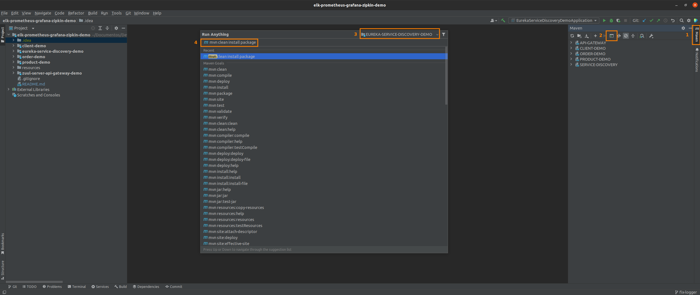
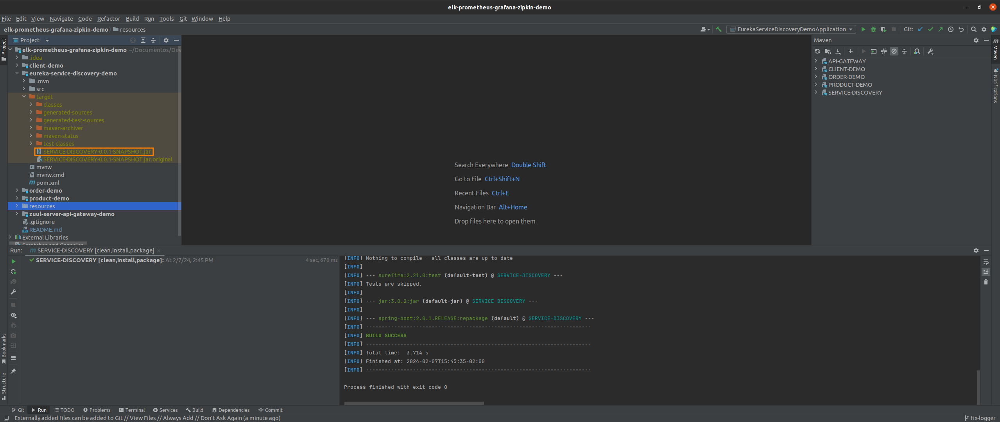

# ELK + PROMETHEUS + GRAFANA + ZIPKIN + MYSQL
Complete Environment to Services Monitoring

> This project consider that you are using the all services related: ELK Stack + Prometheus, Grafana and Zipkin, if is 
> not the case please check the project docker-series in the following repository/branch
> https://github.com/huntercodexs/docker-series/blob/elk_prometheus_grafana_zipkin_mysql_v1 to get more details 
> about the whole process to create a complete environment using these tools

# Using this sample project - Step by Step

> NOTE: Make sure you are using the Java 1.8 or later

To use this repository correctly, please follow the below instructions

1- Clone it from huntercodexs GitHUB account
<pre>
user@host:/home/user$ git clone https://github.com/huntercodexs/elk-prometheus-grafana-zipkin-demo.git .
</pre>

2- Prepare each project to generate a executable jar file

- Check the pom.xml file
- Check the application.properties file
- Check the log4j2.xml

3- Make a required or needed changes in the project code

4- Build each project using Maven tools

5- Get each jar file generated and use as you need

> TIP: Like was mentioned above, it's possible to use the project elk_prometheus_grafana_zipkin_mysql_v1 from 
> huntercodexs GitHUB account to avoid waste time creating an environment to use it.

Below is one image sample to show it

6- To make tests from this repository, you can use the postman file placed in the resources folder 

<pre>
JAVA - ELK-PROMETHEUS-GRAFANA-ZIPKIN-DEMO.postman_collection.json
</pre>

